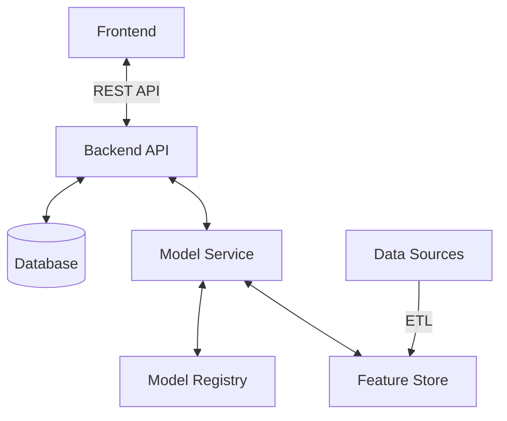

# System Architecture

## High-Level Architecture

The system follows a microservices architecture with clear separation of concerns between the frontend, backend, and data processing components.

## Component Breakdown

### 1. Frontend Layer
- **React Application**: Single Page Application (SPA) built with React and TypeScript
- **State Management**: React Context API with useReducer
- **UI Components**: Built with Shadcn UI and Tailwind CSS
- **Data Visualization**: Recharts for interactive charts and graphs

### 2. Backend Layer
- **API Gateway**: FastAPI for handling HTTP requests
- **Authentication**: JWT-based authentication
- **Endpoints**:
  - `/api/predict` - For making predictions
  - `/api/explain` - For model explanations
  - `/api/data` - For historical data retrieval
  - `/api/models` - For model management

### 3. Data Layer
- **Feature Store**: Stores preprocessed features for model inference
- **Time-Series Database**: For storing sensor and prediction data
- **Model Registry**: Version control for ML models

## Data Flow

1. **Data Ingestion**
   - Collect sensor data from IoT devices
   - Batch and stream processing support
   - Data validation and cleaning

2. **Model Serving**
   - REST API for model inference
   - Batch prediction support
   - Model versioning and A/B testing

3. **Explanation Service**
   - SHAP values calculation
   - Feature importance visualization
   - Counterfactual explanations

## Scalability
- Horizontal scaling for API services
- Asynchronous processing for CPU-intensive tasks
- Caching layer for frequently accessed data

## Security
- JWT-based authentication
- Role-based access control (RBAC)
- Input validation and sanitization
- Rate limiting and request throttling
